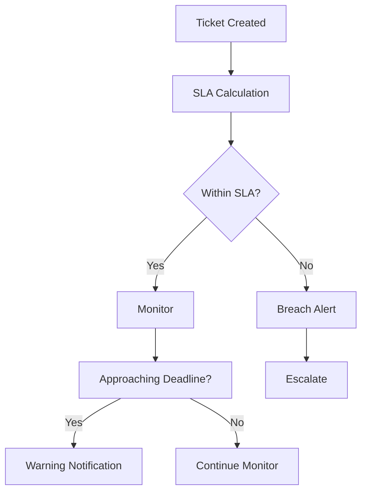

# SLA Management

Track and enforce service level agreements with automated monitoring.

## SLA Features

- Response time SLAs
- Resolution time SLAs
- First response time
- Next response time
- Automatic escalation
- SLA pause on hold
- Holiday handling
- Multi-tier SLAs

## SLA Configuration

- SLA policies
- Priority mapping
- Channel-based SLAs
- Customer-based SLAs
- Business hours
- Holiday calendars
- Escalation rules

## Monitoring & Reporting

- SLA status
- Breach tracking
- Metrics reporting
- Trend analysis
- Performance dashboards
- Alert notifications
