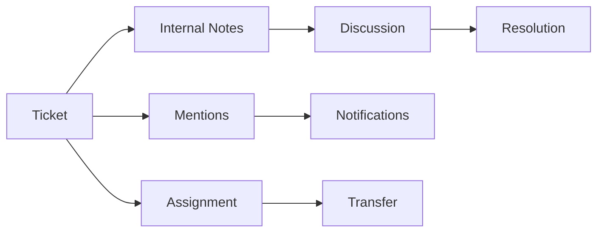

# Team Collaboration

Tools for supporting team members to collaborate and resolve tickets efficiently.

## Collaboration Features

- Internal notes
- @mentions in tickets
- Ticket assignment
- Ticket transfer
- Workload distribution
- Skill-based routing
- Team views
- Shared queues

## Communication

- Real-time notifications
- Comment threads
- Message history
- File attachments
- Mention notifications
- Read receipts
- Email notifications

## Team Management

- Agent profiles
- Skill assignments
- Availability status
- Workload monitoring
- Performance metrics
- Team dashboards
- Reporting
