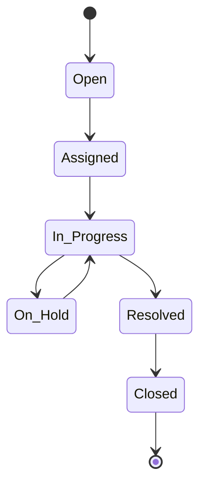

# Ticketing System

Centralized ticket management for organizing and tracking support requests.

## Ticket Management

- Auto-ticket creation
- Priority levels
- Assignment rules
- SLA tracking
- Escalation
- Merge tickets
- Split tickets
- Bulk operations

## Ticket Properties

- Customer info
- Priority and severity
- Category and tags
- Assigned agent
- Due date
- Status
- Custom fields
- Attachments

## Workflows

- Automatic routing
- Round-robin assignment
- Skill-based routing
- VIP customer handling
- Escalation procedures
