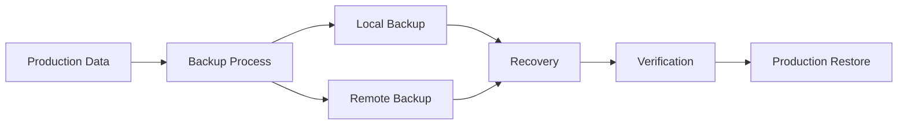

# Backups & Recovery

Robust backup and disaster recovery system ensuring data availability.

## Backup Types

- Full backups
- Incremental backups
- Differential backups
- Continuous replication
- Snapshot-based backups
- Point-in-time recovery

## Backup Frequency

- Hourly backups
- Daily backups
- Weekly backups
- Monthly backups
- Continuous replication
- Custom schedules

## Recovery Options

- Full system recovery
- Partial recovery
- Point-in-time recovery
- Granular recovery
- Standby systems
- Failover automation

## Testing & Validation

- Regular restore tests
- Recovery time objectives
- Recovery point objectives
- Disaster recovery drills
- Backup verification
