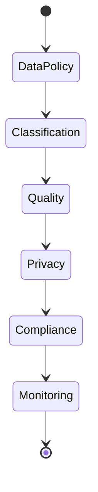

# Data Governance

Framework for data quality, privacy, and regulatory compliance.

## Governance Framework

- Data classification
- Data ownership
- Access policies
- Retention policies
- Deletion policies
- Quality standards
- Privacy controls

## Data Quality

- Validation rules
- Duplicate detection
- Data profiling
- Quality metrics
- Data cleansing
- Integrity checks

## Privacy & Compliance

- PII identification
- Anonymization
- Data residency
- Consent management
- Right to be forgotten
- Data portability
- Regulatory compliance

## Monitoring

- Quality dashboards
- Compliance audits
- Policy violations
- Data lineage
- Impact analysis
