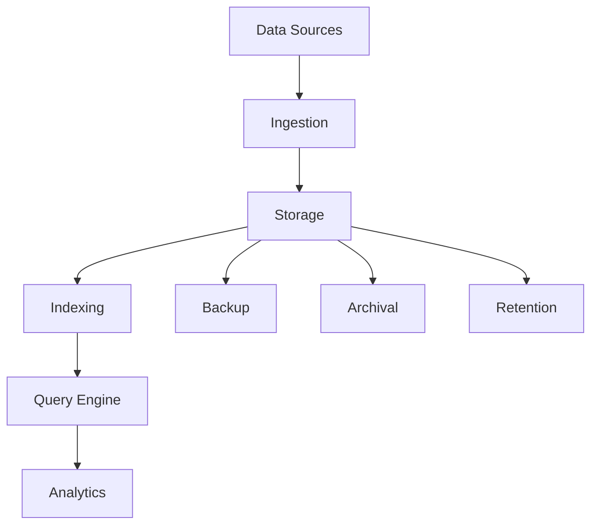

# Data Management

Comprehensive data management system for storing, organizing, and maintaining data integrity.

## Features

- Distributed database
- Data warehousing
- Data lakes
- Data indexing
- Query optimization
- Backup and recovery
- Archive management
- Disaster recovery

## Data Organization

- Schemas and tables
- Collections and documents
- Key-value stores
- Time-series data
- Graph data
- Vector embeddings

## Data Lifecycle

- Data ingestion
- Transformation
- Storage optimization
- Archival
- Retention policies
- Deletion workflows
- Compliance handling

## Integration Points

- **Analytics**: Data analysis
- **Reporting**: Data source
- **Security**: Encryption
- **Backup**: Disaster recovery
