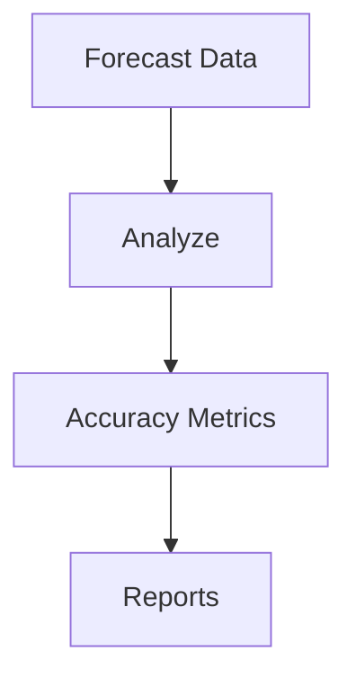

# Analytics & Performance

Demand planning analytics.

## Metrics

- Forecast accuracy
- Mean absolute error
- Demand variability
- Inventory efficiency
- Service levels
- Cost metrics
- Trend analysis
- Performance benchmarking
