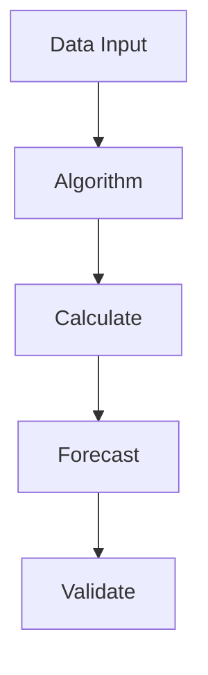

# Forecasting

Demand forecasting methods.

## Methods

- Time series analysis
- Statistical forecasting
- Machine learning
- Expert judgment
- Collaborative forecasting
- Seasonal adjustment
- Trend projection
- Confidence intervals
