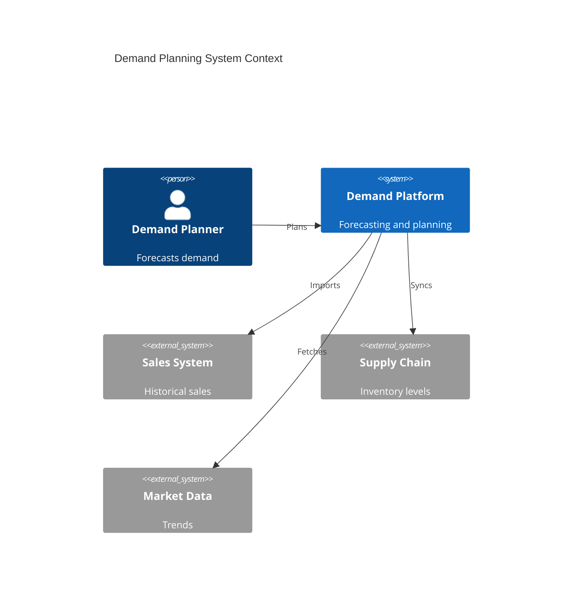
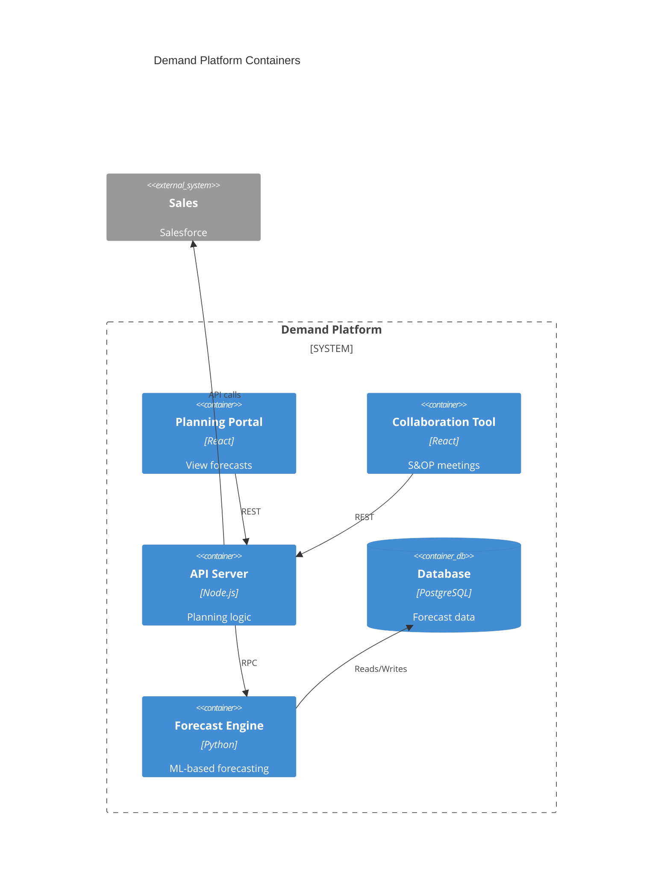

# Demand Planning

Demand forecasting and planning.

## System Context

## System Containers

## Overview

## Features

- Demand forecasting
- Seasonality analysis
- Trend analysis
- Scenario planning
- Inventory planning
- Supply planning
- Collaboration tools
- Forecast accuracy tracking
