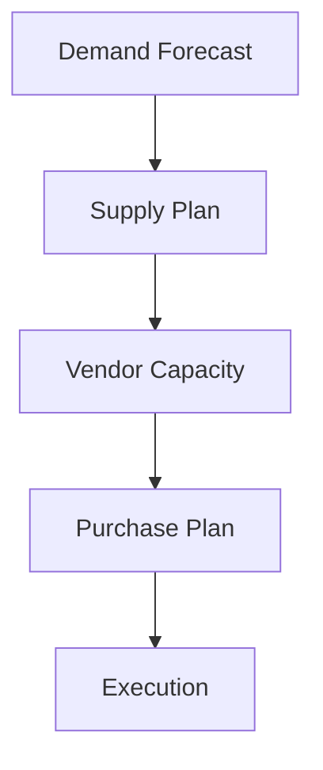

# Supply Planning

Supply chain planning.

## Features

- Supply synchronization
- Vendor capacity planning
- Lead time analysis
- Purchase scheduling
- Order consolidation
- Supplier collaboration
- Material tracking
- Delivery schedules
