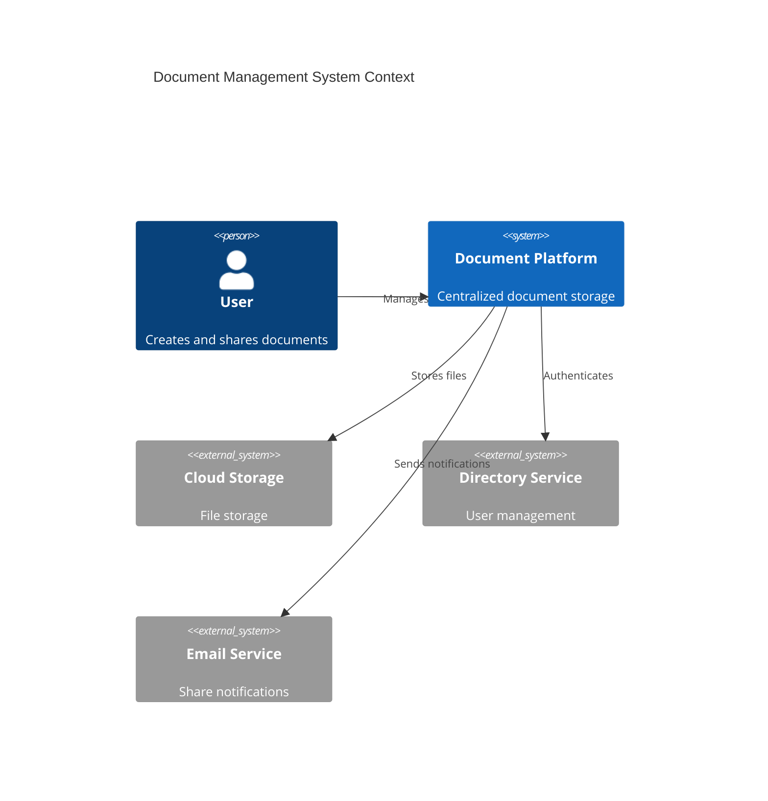
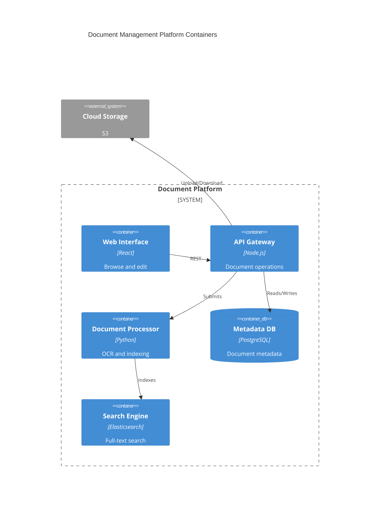
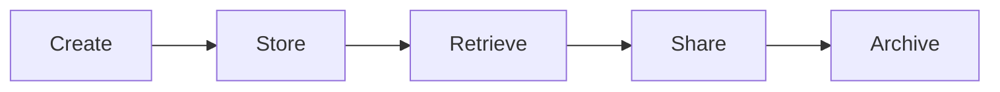

# Document Management

Enterprise document management system.

## System Context

## System Containers

## Overview

## Features

- Document storage
- Version control
- Metadata tagging
- Full-text indexing
- Access controls
- Audit trails
- Digital signatures
- Document retention
