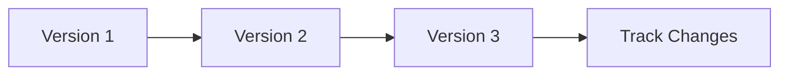

# Version Control

Document version management.

## Features

- Version history
- Restore previous versions
- Compare versions
- Change tracking
- Rollback capability
- Version comments
- Automatic versioning
- Retention policies
