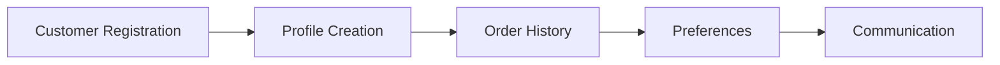

# Customer Management

Manage customer accounts and relationships.

## Features

- Customer registration
- Customer profiles
- Order history
- Saved addresses
- Wishlist management
- Customer preferences
- Account management
- Customer communication
