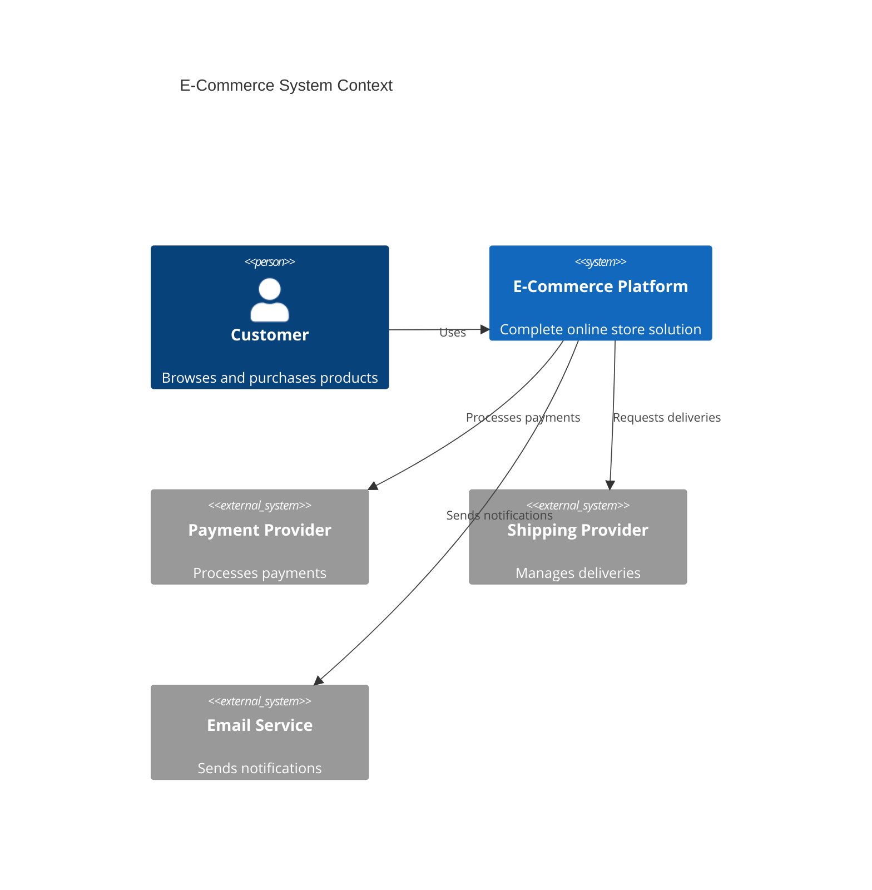
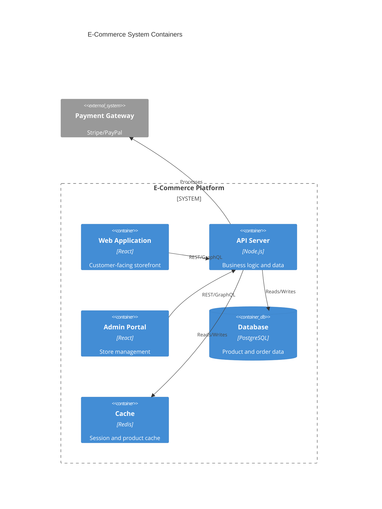
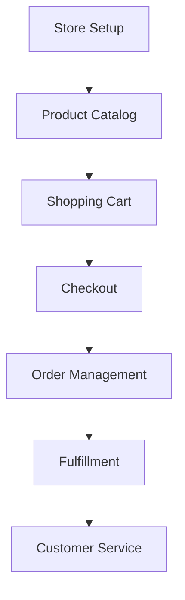

# E-commerce

Complete e-commerce platform for online selling and product management.

## System Context

## System Containers

## Overview

## Core Features

- Online store builder
- Product catalog management
- Shopping cart and checkout
- Order management
- Inventory sync
- Payment processing
- Shipping integration
- Customer accounts
