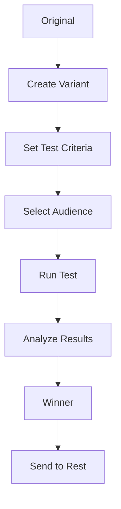

# A/B Testing

A/B testing and multivariate testing for email optimization.

## Testing Types

- Subject line testing
- Content testing
- Send time testing
- Sender name testing
- From address testing
- Call-to-action testing
- Layout testing
- Multivariate testing

## Test Configuration

- Sample size
- Test duration
- Winner criteria
- Confidence level
- Statistical significance
- Test traffic percentage
- Test audience

## Analysis

- Open rate comparison
- Click rate comparison
- Conversion comparison
- Bounce rate comparison
- Statistical significance
- Recommendation engine

## Results

- Winner determination
- Performance metrics
- Insights
- Optimization suggestions
- Winner deployment
- Archive tests
