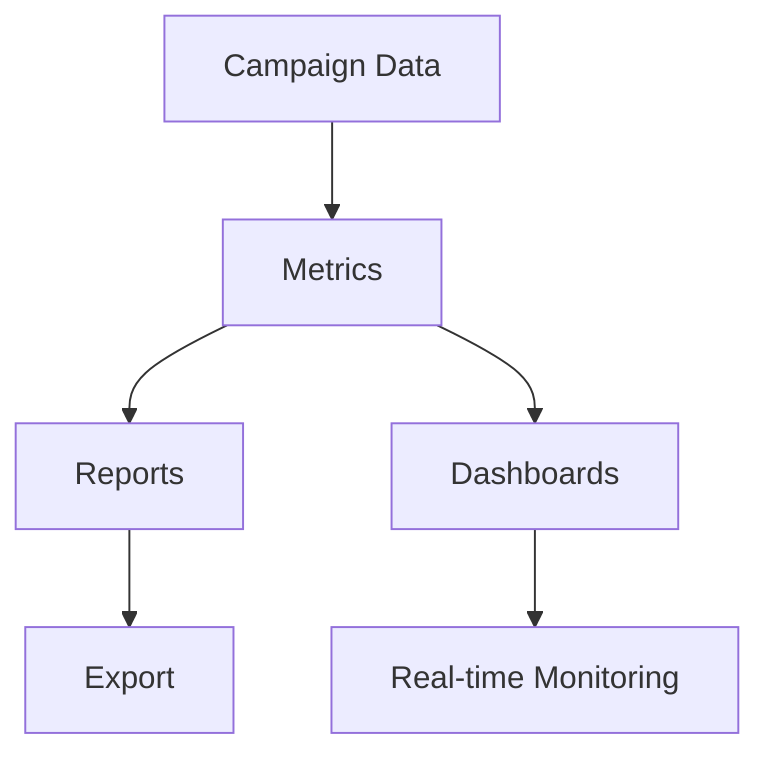

# Analytics & Reporting

Comprehensive analytics and reporting for email campaigns.

## Key Metrics

- Send volume
- Delivery rate
- Open rate
- Click rate
- Click-to-open rate
- Conversion rate
- Unsubscribe rate
- Bounce rate
- List growth

## Reports

- Campaign report
- Performance report
- Audience report
- Deliverability report
- Automation report
- A/B test report
- Custom reports
- Trend analysis

## Dashboards

- Campaign dashboard
- Performance dashboard
- Audience dashboard
- Real-time dashboard
- Custom dashboards
- Executive dashboard

## Analysis

- Benchmarking
- Trend analysis
- Cohort analysis
- Segment analysis
- Device analysis
- Geographic analysis
