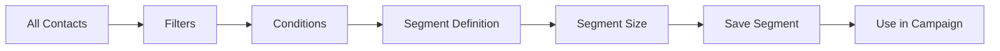

# Audience Segmentation

Create audience segments for targeted email campaigns.

## Segmentation Types

- Demographic segmentation
- Behavioral segmentation
- Engagement segmentation
- Purchase history
- Custom fields
- RFM analysis
- Geographic segmentation
- Psychographic

## Segment Features

- Dynamic segments
- Static segments
- Real-time segments
- Segment conditions
- Advanced filtering
- Nested conditions
- Boolean logic
- Segment preview

## Use Cases

- Personalized campaigns
- Targeted offers
- Behavioral triggers
- Win-back campaigns
- VIP campaigns
- Inactive users
- High-value customers

## Analysis

- Segment size
- Segment growth
- Engagement by segment
- Performance by segment
- Segment trends
