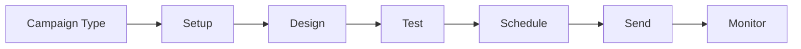

# Campaign Management

Create, manage, and execute email marketing campaigns.

## Campaign Types

- Newsletter
- Promotional
- Transactional
- Drip campaigns
- Event-triggered
- Seasonal campaigns
- Win-back campaigns
- Re-engagement

## Campaign Creation

- Campaign setup
- Goal setting
- Audience selection
- Template selection
- Content editing
- Preview and test
- Schedule date
- Send time optimization

## Features

- Auto-scheduling
- Send time optimization
- Delivery tracking
- Bounce handling
- Spam testing
- Authentication
- CAN-SPAM compliance

## Reporting

- Open rates
- Click rates
- Conversion rates
- Bounce rates
- Unsubscribe rates
- Engagement trends
