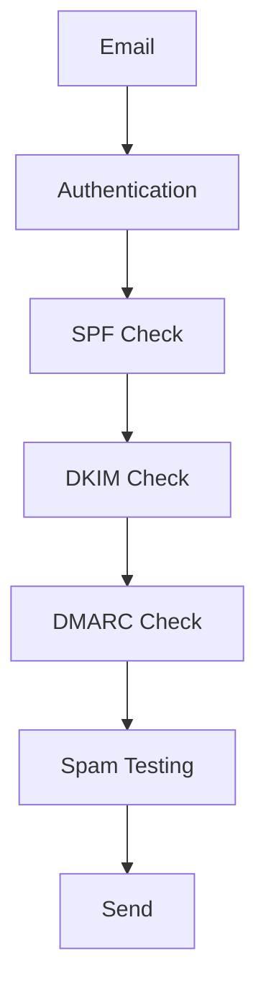

# Deliverability

Manage email deliverability and sender reputation.

## Deliverability Features

- SPF setup
- DKIM signing
- DMARC policies
- Bounce management
- List cleaning
- Engagement scoring
- Sender reputation
- IP warming

## Authentication

- SPF records
- DKIM signing
- DMARC alignment
- Domain verification
- BIMI support
- ARC support

## List Management

- Bounce handling
- Complaint handling
- List segmentation
- Inactive removal
- Spam trap detection
- Validation
- Hygiene

## Monitoring

- Delivery rates
- Bounce rates
- Complaint rates
- Spam folder rates
- Reputation monitoring
- Alerts and notifications
