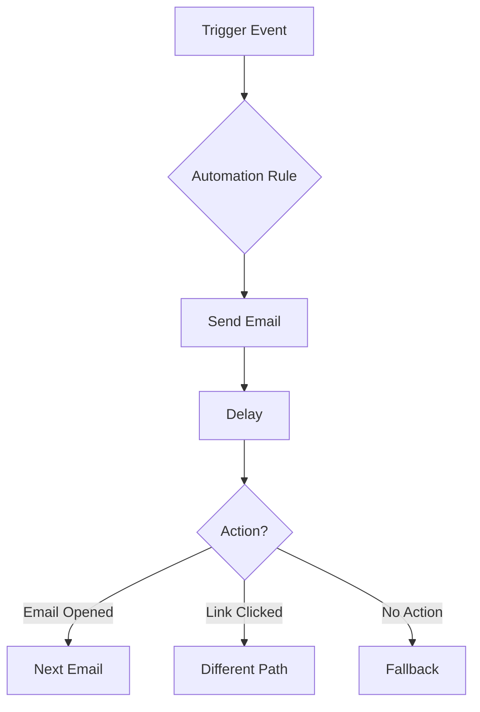

# Marketing Automation

Automate email marketing workflows and drip sequences.

## Automation Types

- Welcome series
- Drip campaigns
- Behavioral triggers
- Anniversary emails
- Engagement scoring
- Lead nurturing
- Abandoned cart
- Re-engagement

## Workflow Features

- Trigger-based
- Time-based delays
- Conditional branching
- A/B testing
- Dynamic content
- List operations
- Tag management
- Integration triggers

## Sequences

- Email sequences
- Multi-step workflows
- Parallel paths
- Wait conditions
- Decision trees
- Loop limits
- Exit conditions

## Reporting

- Automation performance
- Step analytics
- Conversion tracking
- Path analysis
