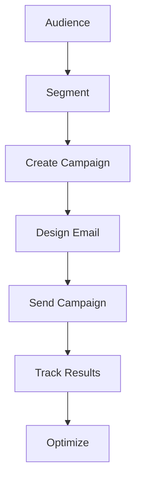

# Email Marketing

Complete email marketing platform for campaigns and customer engagement.

## Core Features

- Email templates
- Campaign creation
- Audience segmentation
- Automation workflows
- A/B testing
- Analytics and reporting
- Deliverability management
- Compliance management

## Capabilities

- Campaign types
- Contact management
- List management
- Template builder
- Drag-and-drop editor
- Personalization
- Dynamic content
- Conditional logic

## Integration Points

- **CRM**: Contact data
- **Analytics**: Campaign metrics
- **Notifications**: Delivery status
- **Reporting**: Performance reports
