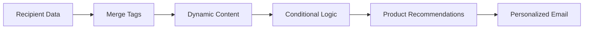

# Personalization

Personalize email content based on recipient data.

## Personalization Features

- Merge tags
- Dynamic content blocks
- Conditional content
- Product recommendations
- Behavioral personalization
- Interest-based content
- Engagement-based content
- Location-based content

## Data Sources

- Contact fields
- Custom fields
- Behavioral data
- Purchase history
- Browsing history
- Email engagement
- CRM data
- External data

## Advanced Features

- AI-powered personalization
- Machine learning
- Content optimization
- Subject line testing
- Send time optimization
- Dynamic subject lines
- Predictive analytics

## Use Cases

- Welcome emails
- Abandoned cart
- Product recommendations
- Birthday emails
- Anniversary emails
- Re-engagement
- VIP campaigns
