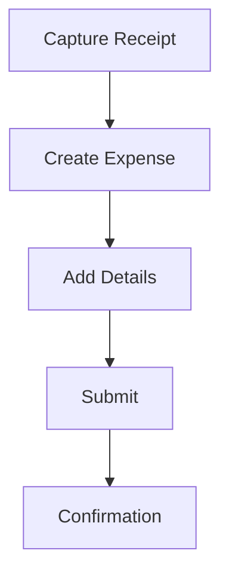

# Expense Submission

Expense submission and capture.

## Features

- Mobile app
- Receipt scanning
- OCR technology
- Expense categories
- Project allocation
- Cost center tracking
- Mileage calculation
- Batch submission
