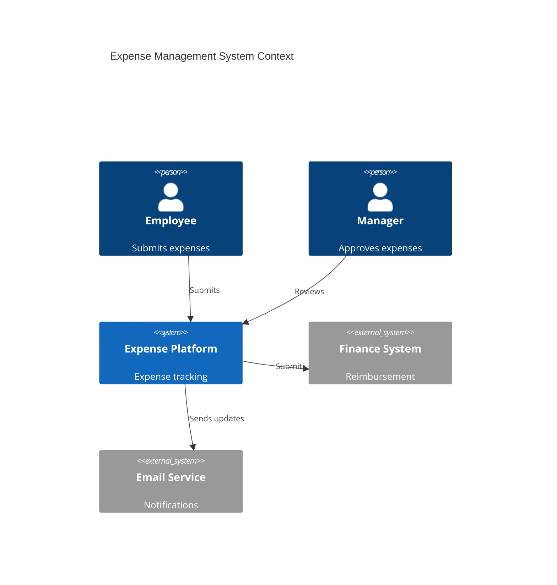
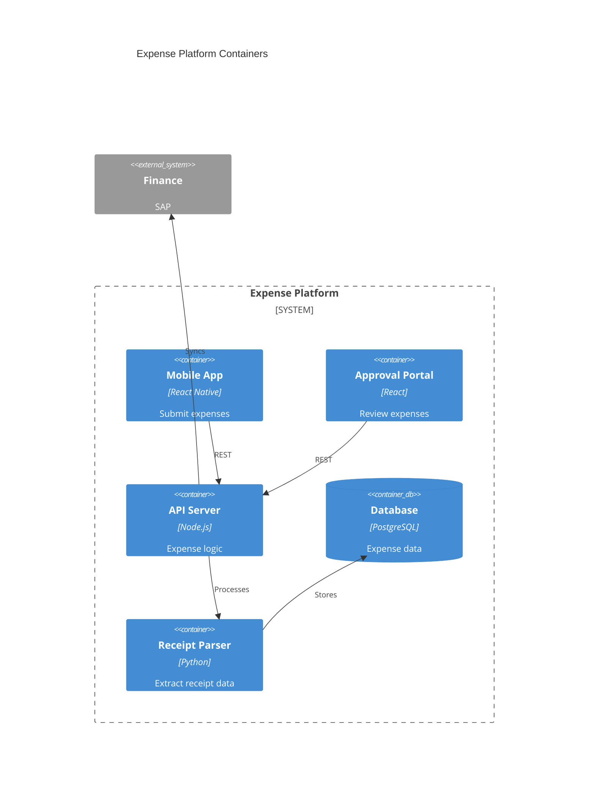

# Expense Management

Employee expense management.

## System Context

## System Containers

## Overview

## Features

- Expense submission
- Receipt capture
- Expense policies
- Approval workflows
- Multi-currency support
- Policy enforcement
- Reimbursement processing
- Expense analytics
