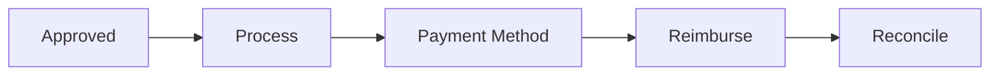

# Reimbursement

Reimbursement processing.

## Features

- Payment processing
- Reimbursement methods
- Direct deposit
- Paycheck integration
- Payment tracking
- Reconciliation
- Dispute handling
- Payment history
