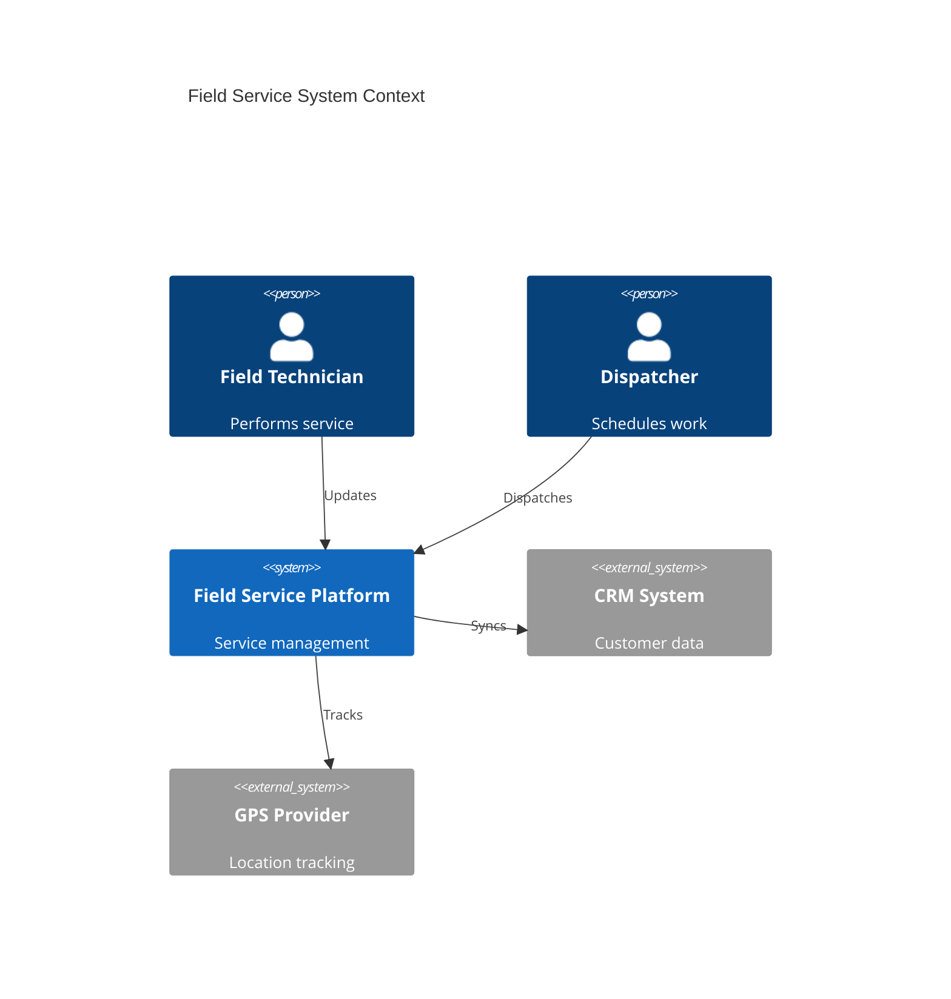
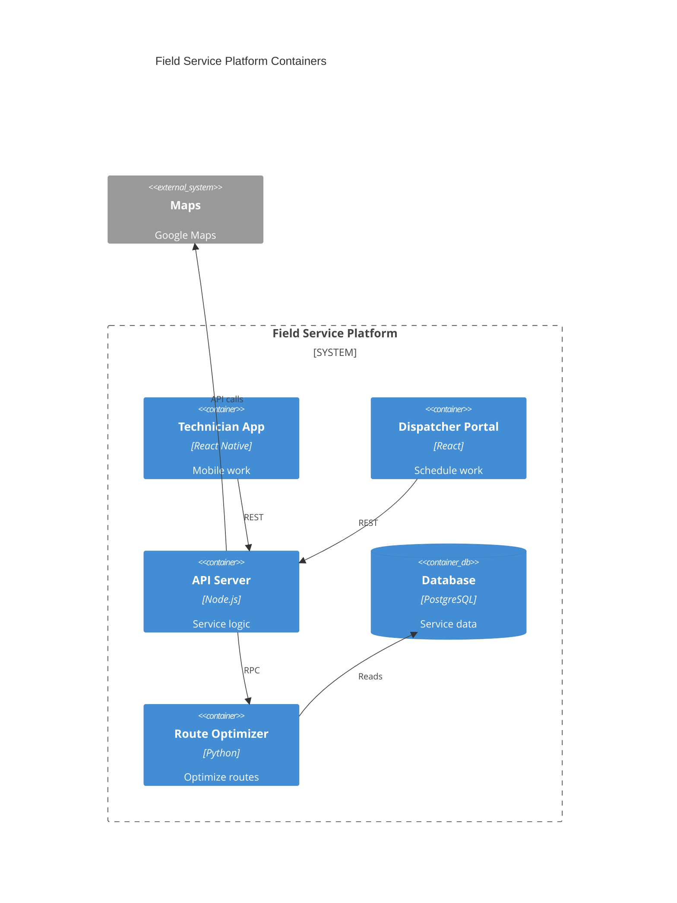
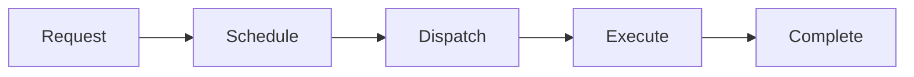

# Field Service

Field service operations management.

## System Context

## System Containers

## Overview

## Features

- Service scheduling
- Technician dispatch
- Real-time location tracking
- Work order management
- Mobile app
- Parts inventory
- Customer communication
- Service analytics
