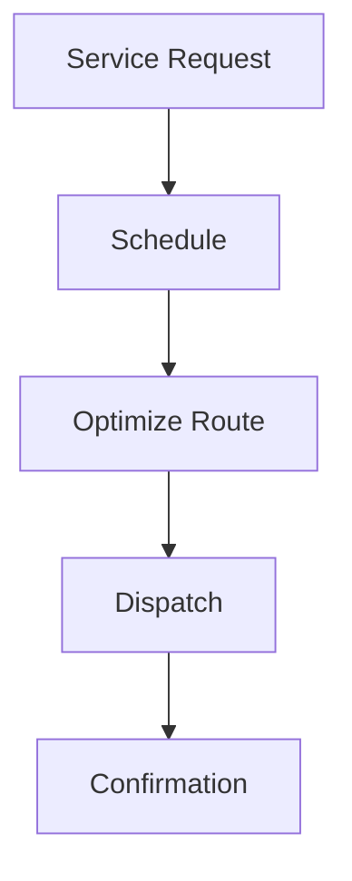

# Scheduling & Dispatch

Service scheduling and dispatch.

## Features

- Appointment scheduling
- Calendar management
- Route optimization
- Technician assignment
- Real-time dispatch
- Customer notifications
- Schedule changes
- Availability management
