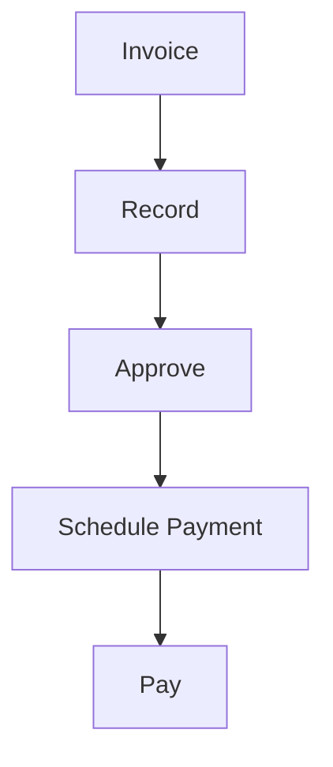

# Accounts Payable

Accounts payable management.

## Features

- Invoice entry
- PO matching
- Approval workflows
- Payment scheduling
- Check printing
- ACH payments
- Invoice tracking
- Payment history
