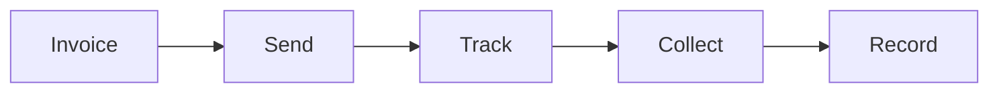

# Accounts Receivable

Accounts receivable management.

## Features

- Invoice generation
- Customer database
- Payment terms
- Aging reports
- Collection tracking
- Dunning management
- Late payment fees
- Customer credits
