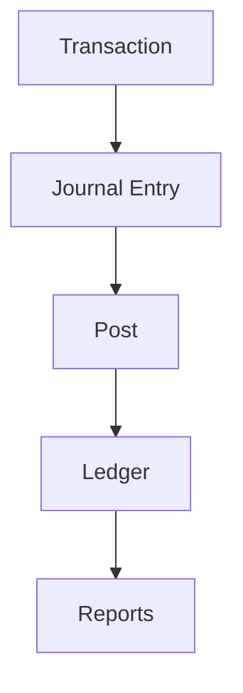

# General Ledger

General ledger and chart of accounts.

## Features

- Chart of accounts
- Journal entries
- Multi-currency support
- Intercompany transactions
- Account reconciliation
- Balance verification
- Period closing
- Account analysis
