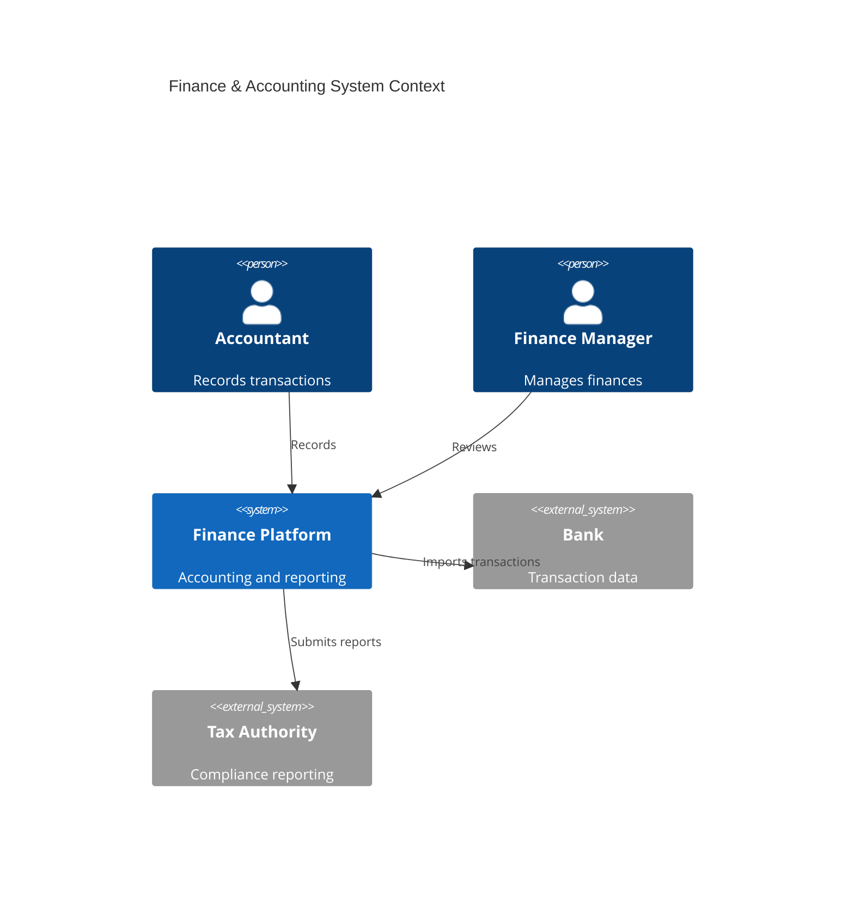
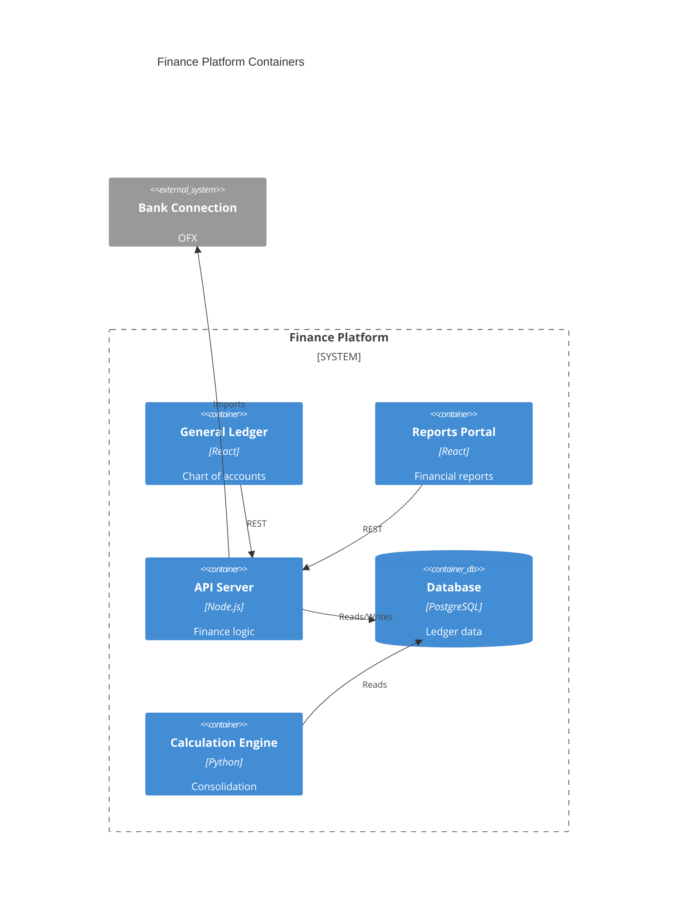
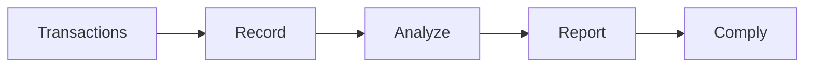

# Finance & Accounting

Finance and accounting management.

## System Context

## System Containers

## Overview

## Features

- General ledger
- Accounts payable
- Accounts receivable
- Expense management
- Fixed assets
- Financial reporting
- Tax compliance
- Audit trails
