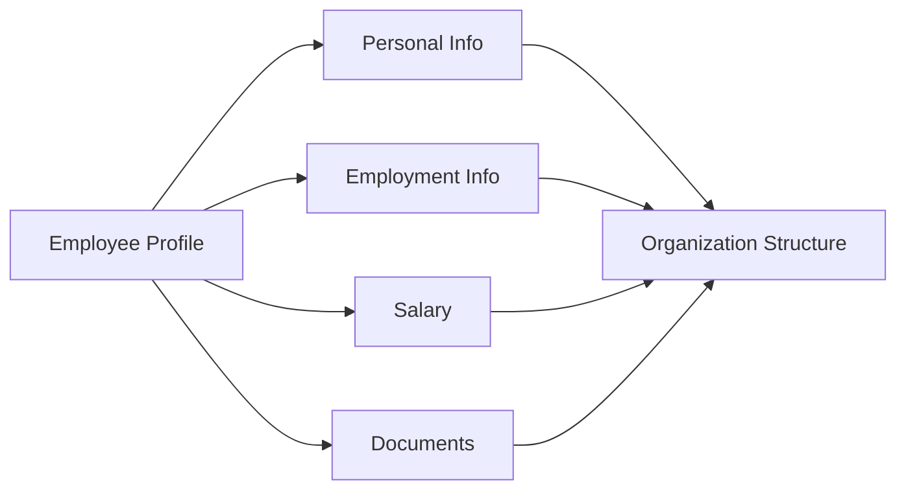

# Employee Records

Centralized employee records and information management.

## Employee Information

- Personal details
- Contact information
- Emergency contacts
- Photo and signature
- Identification documents
- Legal work authorization
- Background check status
- Social profiles

## Employment Information

- Job title
- Department
- Manager
- Employment type
- Hire date
- Work location
- Reporting relationship
- Organizational hierarchy

## Documents

- Employment contracts
- Offer letters
- Policy acknowledgments
- Certifications
- Credentials
- Licenses
- Training records
- Performance reviews
