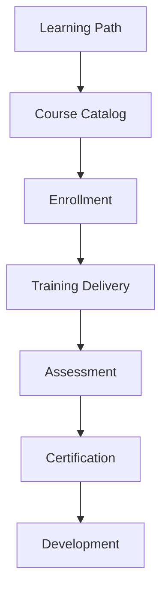

# Learning & Development

Learning management and professional development system.

## Learning Features

- Course library
- Learning paths
- Self-paced courses
- Instructor-led training
- Blended learning
- Video training
- Quizzes and tests
- Certificates

## Course Management

- Course creation
- Content library
- Instructor management
- Scheduling
- Enrollment
- Tracking
- Completion
- Certification

## Training Types

- Compliance training
- Onboarding training
- Skills training
- Leadership training
- Role-specific training
- Custom training
- External courses

## Development

- Career development plans
- Skill assessments
- Skill development
- Mentoring programs
- Coaching
- Conference attendance
- Certifications
- Tuition reimbursement
