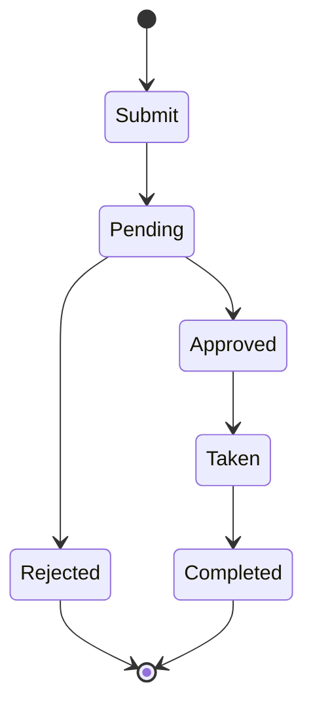

# Leave Management

Employee leave and absence management system.

## Leave Types

- Paid time off
- Vacation leave
- Sick leave
- Personal leave
- Maternity leave
- Paternity leave
- Sabbatical
- Unpaid leave

## Leave Management

- Leave requests
- Approval workflows
- Approval chain
- Compliance check
- Balance tracking
- Accrual calculation
- Carryover policies
- Payout on exit

## Features

- Self-service requests
- Mobile requests
- Calendar view
- Team calendar
- Bulk requests
- Backup assignment
- Notification system
- Leave history

## Compliance

- Leave policies
- Legal requirements
- Accrual rules
- Carryover limits
- Usage tracking
- Audit trails
