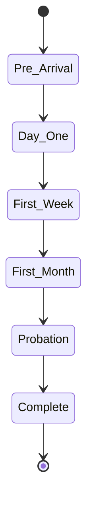

# Onboarding

Structured onboarding process for new employees.

## Onboarding Process

- Pre-arrival tasks
- First day checklist
- Equipment setup
- System access provisioning
- Department introduction
- Role-specific training
- HR orientation
- Policy training

## Onboarding Tasks

- Account creation
- Email setup
- Office access
- IT equipment
- Orientation meeting
- Documentation
- Benefits enrollment
- Direct deposit setup

## Training

- Company overview
- Policy training
- System training
- Role training
- Mentor assignment
- Training tracking
- Feedback collection

## Documentation

- Employee handbook
- Policy documents
- Benefit guides
- Safety procedures
- Tax forms
- Insurance forms
