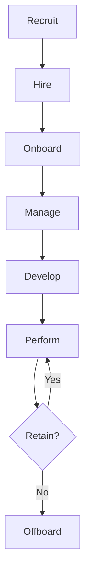

# Human Resources

Comprehensive HR management system for employee lifecycle and workforce management.

## Core Modules

- Recruitment and hiring
- Applicant tracking
- Employee records
- Onboarding
- Payroll management
- Time and attendance
- Performance management
- Learning management

## Features

- Job posting
- Application tracking
- Candidate management
- Employee profiles
- Salary management
- Benefits management
- Leave management
- Absence tracking

## Integration Points

- **Billing**: Payroll processing
- **Analytics**: HR analytics
- **Notifications**: HR alerts
- **Security**: Access control
