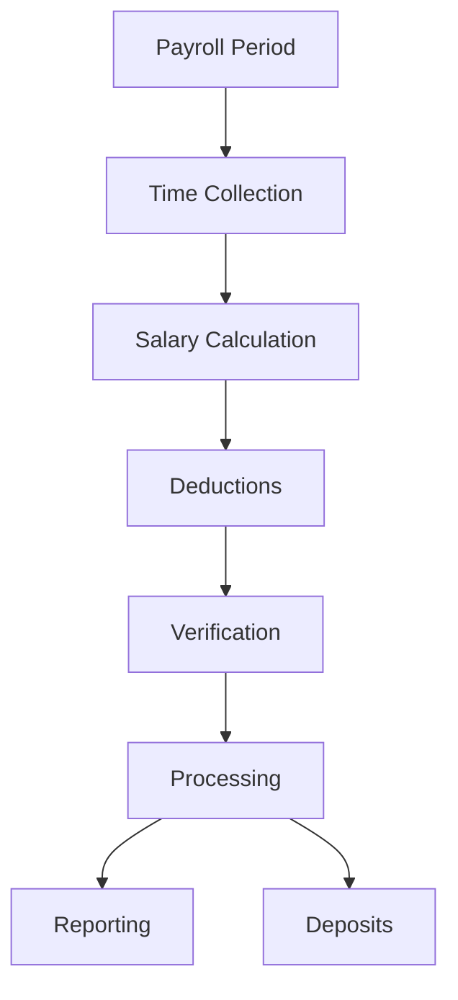

# Payroll Management

Complete payroll processing and salary management.

## Payroll Features

- Salary management
- Hourly/salaried employees
- Shift management
- Overtime calculation
- Bonus management
- Commission tracking
- Deductions
- Tax withholding

## Payroll Processing

- Manual entry
- Time sheet import
- Payroll calculation
- Tax calculation
- Deduction processing
- Payment processing
- Direct deposit
- Check printing

## Reports

- Payroll register
- Tax reports
- Deduction reports
- Payroll journal
- 941 forms
- W2 forms
- 1099 forms
- Employee pay stubs

## Compliance

- Tax compliance
- Labor law compliance
- Overtime rules
- Minimum wage
- Garnishment handling
- Audit trails
