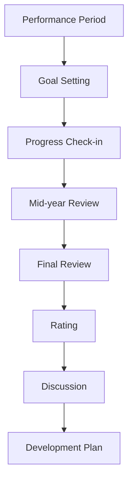

# Performance Management

Comprehensive performance management and review system.

## Performance Features

- Goal setting
- Goal tracking
- Progress updates
- Check-ins
- Feedback collection
- Performance reviews
- 360 feedback
- Peer reviews

## Review Process

- Review template
- Self-assessment
- Manager assessment
- Multiple raters
- Calibration process
- Rating system
- Ranking
- Review approval

## Goals

- SMART goals
- Department goals
- Individual goals
- Goal alignment
- Goal tracking
- Goal weightage
- OKRs support

## Development

- Development plans
- Training recommendations
- Career paths
- Mentoring
- Promotion eligibility
- Skills assessment
