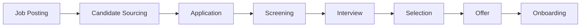

# Recruitment

End-to-end recruitment and hiring system.

## Recruitment Features

- Job posting
- Multi-channel posting
- Application forms
- Resume parsing
- Candidate screening
- Pipeline management
- Interview scheduling
- Offer management

## Applicant Tracking

- Application status
- Interview feedback
- Assessment scores
- Reference checks
- Background verification
- Candidate communication
- Rejection reasons
- Rehire candidates

## Integration

- Job boards
- Email integration
- Calendar integration
- Background check services
- Assessment tools
- Offer letter generation
