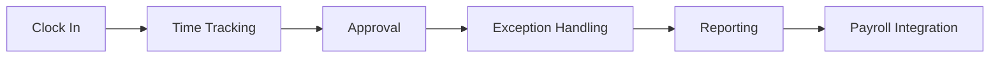

# Time & Attendance

Employee time tracking and attendance management.

## Tracking Features

- Clock in/out
- Mobile clocking
- Web clocking
- Geolocation verification
- Face recognition
- Biometric readers
- Project time tracking
- Task time logging

## Attendance Management

- Attendance records
- Absence tracking
- Late arrival
- Early departure
- Overtime tracking
- Holiday tracking
- Shift management
- Schedule adherence

## Exception Handling

- Approval workflows
- Time corrections
- Missing punches
- Attendance policies
- Variance reports
- Exception escalation

## Integration

- Payroll system
- Scheduling system
- Project management
- Reporting
