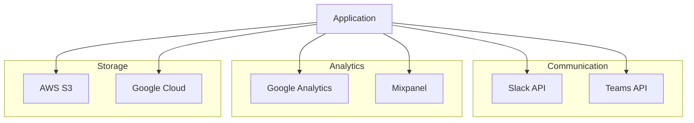

# API Connectors

Pre-built connectors for seamless integration with popular services.

## Integration Setup

- Guided setup wizards
- OAuth flows
- API key management
- Test connections
- Error handling
- Logging and debugging

## Data Synchronization

- One-way sync
- Two-way sync
- Scheduled syncs
- Real-time sync
- Conflict resolution
- Data transformation
