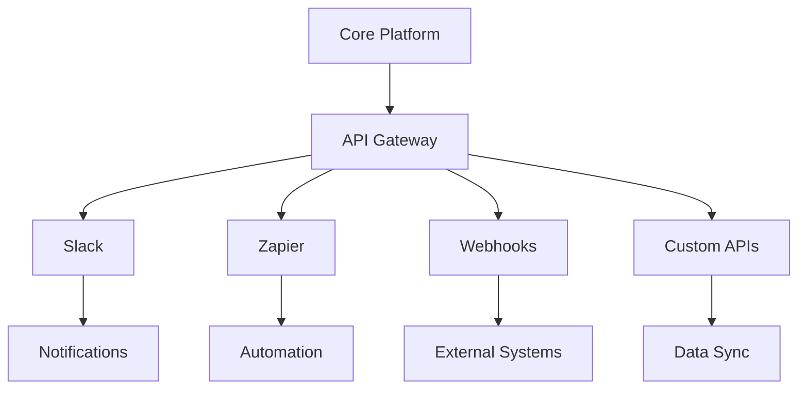

# Integrations

Connect your application with popular third-party services and APIs.

## Available Integrations

- **Communication**: Slack, Microsoft Teams
- **Automation**: Zapier, Make
- **Analytics**: Google Analytics, Segment
- **CRM**: Salesforce, HubSpot
- **Storage**: AWS S3, Google Cloud
- **Payments**: Stripe, PayPal

## Integration Methods

- REST API
- Webhooks
- OAuth authentication
- Custom connectors
- Batch imports/exports

## Integration Points

- **Event System**: Trigger external actions
- **Data Pipeline**: Sync data across platforms
- **Authentication**: Secure credential management
- **Rate Limiting**: API usage controls
