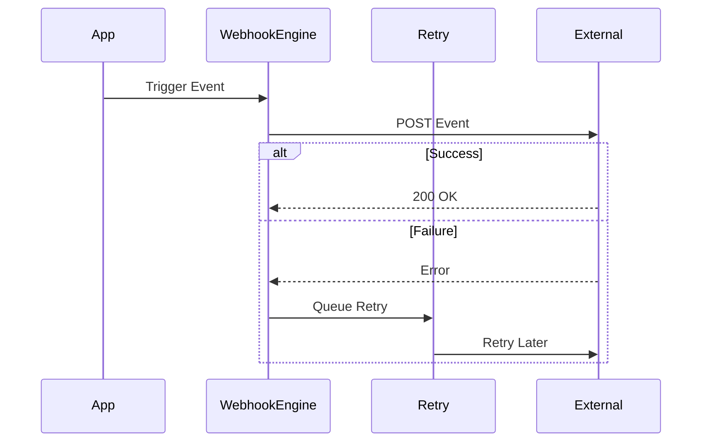

# Webhooks

Send real-time events to external systems via webhooks.

## Webhook Events

- User created/updated/deleted
- Payment processed
- Subscription changed
- Content published
- Error occurred
- Custom events

## Retry Policy

- Exponential backoff
- Maximum retry attempts
- Failed event logging
- Manual retry capability

## Security Features

- HMAC signature verification
- IP whitelisting
- Rate limiting
- Webhook signing tokens
