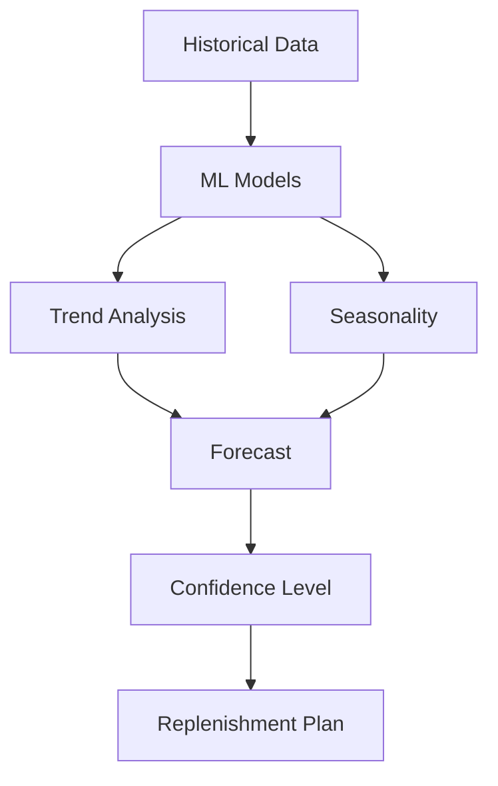

# Demand Forecasting

Machine learning-based demand forecasting for inventory planning.

## Forecasting Methods

- Time series analysis
- Moving average
- Exponential smoothing
- Linear regression
- Machine learning models
- Seasonal decomposition
- Trend analysis

## Forecast Features

- Product-level forecasts
- Category forecasts
- Warehouse-level forecasts
- Forecast accuracy tracking
- Scenario modeling
- Collaborative forecasting
- Adjustments and overrides

## Data Inputs

- Historical sales
- Seasonality patterns
- Promotional calendars
- Market trends
- External factors
- Manual inputs
