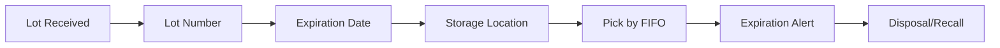

# Lot & Expiration

Track product lots and manage expiration dates.

## Lot Features

- Lot number tracking
- Manufacturing date
- Expiration date
- Warranty information
- Batch alerts
- Auto-assignment
- Lot visibility
- Lot traceability

## FIFO Management

- First-in, first-out
- Expiration sorting
- Rotation alerts
- Shelf life tracking
- Quality hold
- Removal procedures
- Waste tracking

## Compliance

- Recall management
- Traceability
- Regulatory compliance
- Documentation
- Disposal tracking
- Audit trails
