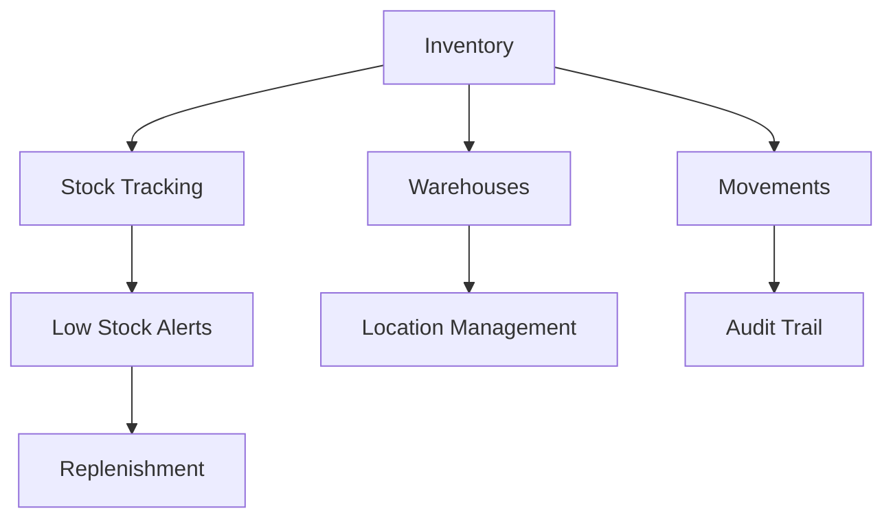

# Inventory Management

Complete inventory management system for tracking stock levels and supply chain.

## Core Features

- Real-time stock tracking
- Multi-warehouse management
- Barcode scanning
- SKU management
- Stock movements
- Inventory audits
- Forecasting
- Supplier management

## Inventory Operations

- Receive inventory
- Transfer stock
- Adjust inventory
- Mark as obsolete
- Batch tracking
- Serial number tracking
- Quality checks
- Damage tracking

## Integration Points

- **Billing**: Sales orders
- **Reporting**: Inventory reports
- **Notifications**: Low stock alerts
- **Analytics**: Demand forecasting
