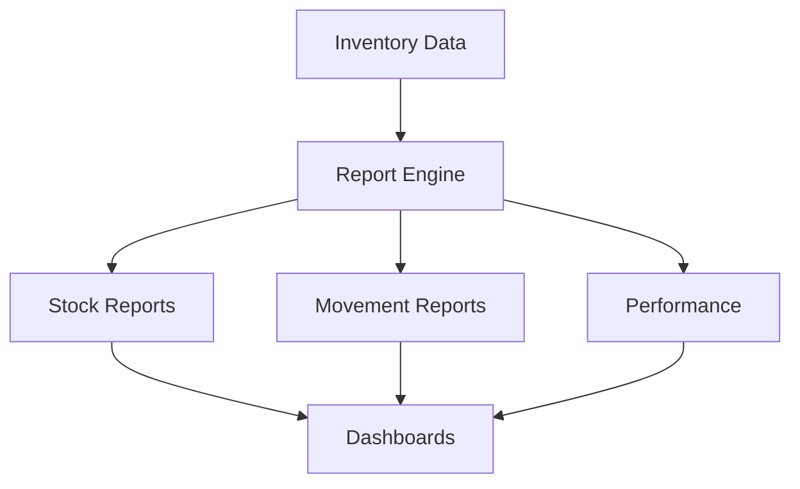

# Reporting & Analytics

Comprehensive reporting and analytics for inventory insights.

## Report Types

- Stock status reports
- Slow-moving inventory
- Fast-moving inventory
- Inventory aging
- Turnover analysis
- Valuation reports
- Movement reports
- Variance reports

## Analytics

- Stock levels
- Inventory value
- Turnover ratio
- Carrying cost
- Order frequency
- Lead time analysis
- Supplier performance
- Seasonal trends

## Dashboards

- Real-time inventory
- Warehouse dashboard
- Supplier dashboard
- Manager dashboard
- Executive summary
- Custom dashboards
