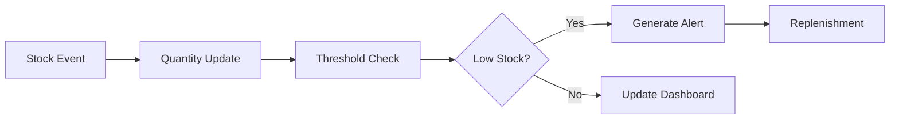

# Stock Tracking

Monitor inventory levels across warehouses in real-time.

## Tracking Features

- Current stock levels
- Available quantity
- Allocated quantity
- On-order quantity
- Stock movements
- Stock history
- Variance tracking
- Location details

## Stock Information

- SKU details
- Product name
- Cost
- Selling price
- Reorder point
- Reorder quantity
- Lead time
- Expiration date

## Alerts

- Low stock warnings
- Out of stock alerts
- Overstock warnings
- Variance alerts
- Expiration alerts
