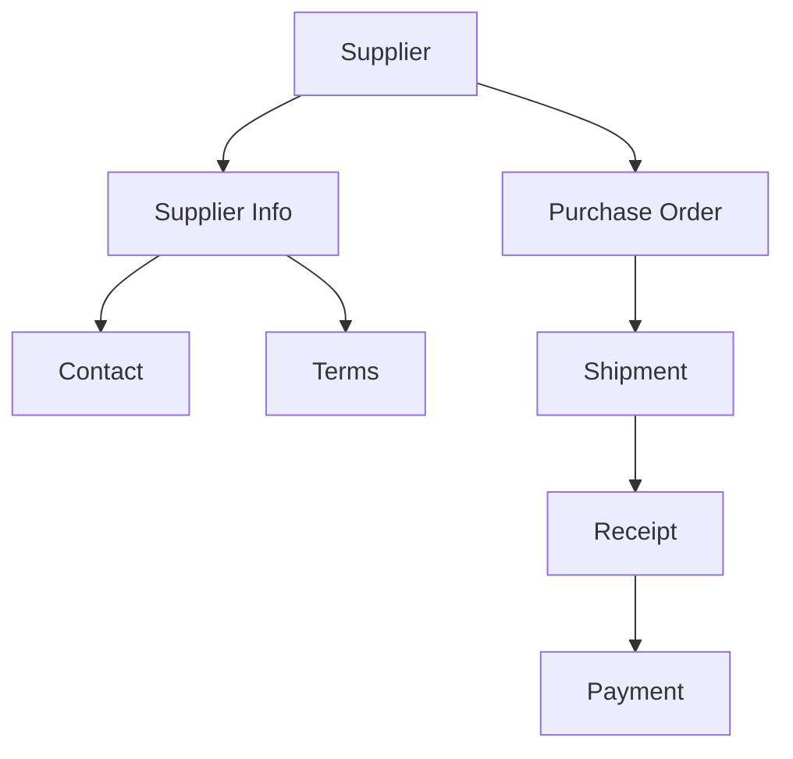

# Supplier Management

Manage supplier relationships and purchase orders.

## Supplier Features

- Supplier database
- Contact information
- Performance tracking
- Pricing agreements
- Lead times
- Quality metrics
- Certification tracking
- Payment terms

## Purchase Orders

- PO creation
- Item selection
- Pricing calculation
- Delivery scheduling
- Tracking numbers
- Receiving verification
- Invoice matching
- Payment processing

## Supplier Performance

- On-time delivery
- Quality metrics
- Cost tracking
- Lead time analysis
- Compliance tracking
