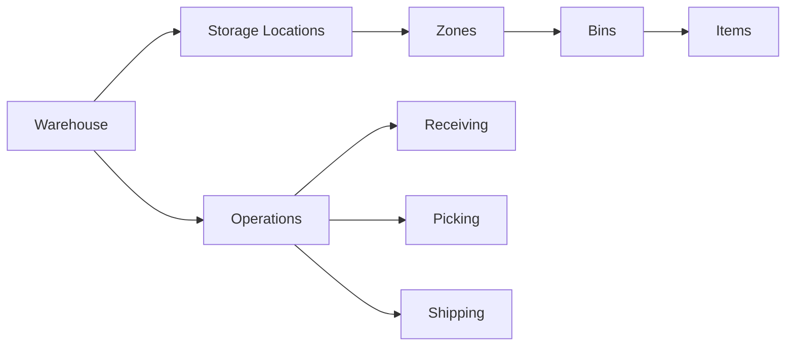

# Warehouse Management

Manage inventory across multiple warehouse locations.

## Warehouse Features

- Multiple warehouse locations
- Zone management
- Bin locations
- Aisle management
- Rack management
- Location codes
- Capacity tracking
- Distance calculation

## Operations

- Receiving goods
- Put-away operations
- Pick operations
- Pack operations
- Shipping
- Cycle counting
- Physical inventory
- Location optimization

## Workflows

- Receiving workflow
- Storage assignment
- Pick paths
- Packing workflow
- Shipping workflow
